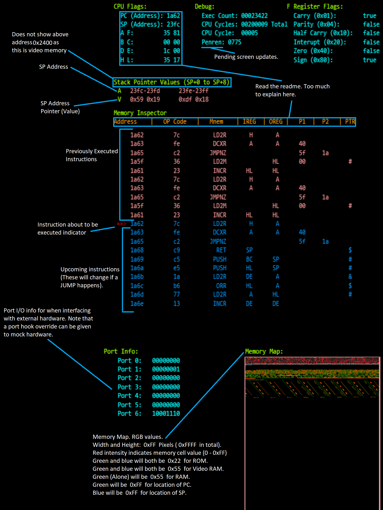

# Z80 CPU Emulator

## Running:

First:

`npm install` To install dependencies

Then any of:

`npm start` To start a http server that will open your browser and run the canvas version. If you have a ROM already, you can drag-drop it onto the canvas. It accepts Z80 binaries, or JSON files converted with `bin2json`. Make sure to `Shift + R` and then `Shift + Q` first, if you already have something loaded before dragging and dropping.

`npm run cli` To run the cli version (this only prints disassembler info at the moment)

`npm run test` Runs unit tests of CPU.

### Decompiler

`npm run decom -- LIST OF FILES` Runs the disassembler on all given files and outputs to `originalFileName.asm`

You can pass Z80 binary ROM files, or JSON files generated by `bin2json` (Command below). bin2json files are not compatible with the -c flag.
Only binary files, or json files can be disassembled at the same time - Not both together.

`-c`   Combine files into 1 asm file. - Output will be the first file name. All passed files will be assembled in their passed order, with no gaps in memory.

`-q`   Quiet Mode - No outputs while disassembling.

`-h`   Help - This message.

### Binary to JSON conversion.

`npm run bin2json -- LIST OF FILES` Converts binary files into json files that the emulator can also load. It outputs the file names as: `originalFileName.json`.

`-c` Chunks and combines listed files into the same JSON file in the order specified. You can manually adjust the offset in the JSON file for each chunked file. Output file name will be the first file specified.

`-l` Increases output file size (adds JSON spacing, newlines), but makes it easier to work with.

Example: `npm run bin2json -- -c /rom/invaders/invaders1.h.bin /rom/invaders/invaders2.g.bin /rom/invaders/invaders3.f.bin /rom/invaders/invaders4.e.bin`

## Other Stuff

Z80 Specs: http://datasheets.chipdb.org/Mostek/3880.pdf

A copy of this PDF, along with other documentation can be found in the `/docs/` folder.

## Future Plans:
* Make Game Boy compatible.
* Add IX and IY index registers.
* Code interrupts for key events and interactivity.
* Finish off missed instructions.
* Add in correct cycle timing for a browser environment.
* Add a command line version on this (So it can be used in a CLI environment).
* Complete unit tests for CPU.

## Disassembler and Flags

### Read this to keep some semblance of sanity.

`Warning: This is my own intreptation and understanding of the instructions provided by the Z80 processor. A lot of this was discovered by trial and error.`

I tried to keep this code a balance between not repeating myself and in the process creating 18 layers of functions. Pls forgive me and my protension.
I have modified the assembly OP codes to be easier to understand by those not familiar with the Z80 processor's instruction set for the disassembler.

Penren stands for Pending Render updates. This is how many memory cells have changed in the game's memory, but haven't yet been drawn by the canvas.

#### Disassembler Instructions:

##### Registers
    A  -  Results from the ALU end up here. 2 bytes, grouped with F.
    B  -  General register, 2 bytes, grouped with C
    C  -  General register, 2 bytes, grouped with B
    D  -  General register, 2 bytes, grouped with E
    E  -  General register, 2 bytes, grouped with D
    F  -  F is a special flag. Mainly used for overflows and parity. 2 bytes, grouped with A
    H  -  General register, 2 bytes, grouped with L. These are generally used as a buffer, or for calculations.
    L  -  General register, 2 bytes, grouped with H. These are generally used as a buffer, or for calculations.
    ix -  Index Register
    iy -  Index Register
    sp - Stack pointer, 4 bytes
    pc - Program counter (Current executing address), 4 bytes

##### Terms:
  * PC      - Program Counter. This is a special register used by the CPU. This is the command that's currently being executed.
            It always increases by at least 1, and no more than 3 after each instruction (with expection to the index registers, which can have up to 4), some instructions can increase it by 2 or 3.
  * OREG    - Output to registers. Usually used to determine a memory location, but not always.
  * IREG    - Input from registers. Usually used to load a value from to write somewhere.
  * P1      - Parameter 1. This will be PC + 1 in memory.
  * P2      - Parameter 2. This will be PC + 2 in memory.
  * PTR     - Pointer value. If this is set it will look up using the value stored in that memory location, and use it. Basically a pointer.

            ** # - Output values are the location
            ** & - Input values are the location
            ** ! - Unknown (Used for UKNOP)

  Note: `The special flag F, or the PC flag will never be specified in IREG or OREG.`

  Mnemonics:

    UKNOP: Unknown Operation
      I don't know what this does, so I couldn't write any code to deal with it. An error should be thrown. If one isn't by some chance, crazy things gonna happen.

    NOP: No Operation
      This spins the CPU +4 cycles. Usually used to let hardware settle, or to wait.

    LD2M: Load to memory location
      Uses OREG (or P1 and P2) to get a memory location, and writes either P1 or IREG into it.
      Note that if there is 2 parameters, and 1 OREG, the pointer flag maybe set.

    LD2R: Load to register
      Uses both registers in OREG to get a memory location; or, values in P1 and/or P2, and writes that value to one or 2 registers.
      If a memory location is provided, only one register will be written to.
      If 1 parameter is provided, only 1 register is written to. If 2 parameters are provided, 2 registers are written to.
      Note that if there is 2 parameters, and 1 OREG, the pointer flag maybe set.
      
    INCR: Increment register(s) by 1
      Increments a register, or 2 registers (the pair register) by 1. Register(s) effected are described in OREG and IREG.

    DCRR: Decrement register(s) by 1
      Decrements a register, or 2 registers (the pair register) by 1. Register(s) effected are described in OREG and IREG.

    INXR: Increment register(s) by X
      This loads a value from either P1 and/or P2; or from IREG, then adds and stores it into OREG.
      Technically any registers in OREG should also be added into IREG, since they need to be passed into the ALU with IREG, but were left out for brevity's sake.
      If two parameters are used, there will be 2 OREGs
      If 2 IREGs are used, there will be 2 OREGs

    ICXR: Increment carry register(s) by X
      This loads a value from either P1 and/or P2; or from IREG, then adds the carry flag from the F register and stores it into OREG.
      Technically any registers in OREG should also be added into IREG, since they need to be passed into the ALU with IREG, but were left out for brevity's sake.
      If two parameters are used, there will be 2 OREGs
      If 2 IREGs are used, there will be 2 OREGs

    DEXR: Decrement carry register(s) by X
      The first parameter is added to the carry flag in the F register before this operation is performed.
      This loads a value from either P1 and/or P2; or from IREG, then substracts and stores it into OREG.
      Technically any registers in OREG should also be added into IREG, since they need to be passed into the ALU with IREG, but were left out for brevity's sake.
      If two parameters are used, there will be 2 OREGs
      If 2 IREGs are used, there will be 2 OREGs

    DCXR: Increment register(s) by X
      This loads a value from either P1 and/or P2; or from IREG, then subtracts and stores it into OREG.
      Technically any registers in OREG should also be added into IREG, since they need to be passed into the ALU with IREG, but were left out for brevity's sake.
      If two parameters are used, there will be 2 OREGs
      If 2 IREGs are used, there will be 2 OREGs

    SUBX: Decrement register(s) by X
      This loads a value from either P1 and/or P2; or from IREG, then subtracts it. It does not store the result.
      This does modify the F register.

    INCM: Increment memory by 1
      Increments the value in a memory location by 1.
      If IREG has 2 registers present, then that is the memory location.
      Otherwise it will be a pointer of P1 and P2

    DCRM: Decrement memory by 1
      Decrements the value in a memory location by 1.
      If IREG has 2 registers present, then that is the memory location.
      Otherwise it will be a pointer of P1 and P2

    RLC: 8-bit Rotational Left Carry
      Rotates the bits loaded from P1, or IREG, and stores them in OREG. The most left bit is moved into the carry flag and to bit 0.

    RRC: 8-bit Rotational Right Carry
      Rotates the bits loaded from P1, or IREG, and stores them in OREG. The most right bit is moved into the carry flag and to bit 7.

    RRC9: 9-bit Rotational Right Carry
      Performs a 9-bit right rotation to the bits loaded from P1, or IREG, and stores them in OREG. The carry is copied into bit 7, then the bit leaving on the right is copied into the carry.

    RLC9: 9-bit Rotational Left Carry
      Performs a 9-bit left rotation to the bits loaded from P1, or IREG, and stores them in OREG. The carry is copied into bit 7, then the bit leaving on the left is copied into the carry.

    CPL: Invert All Bits
      Inverts all bits from IREG and stores them in OREG

    SCF: Set Carry Flag
      Sets the carry flag bit (On).

    CCF: Inverts the carry flag
      Flips the carry flag in the F register

    SIF: Sets the interrupt bit
      Sets the interrupt flag bit (On).

    DIF: Disable the interrupt bit
      Turns off the interrupt flag bit (Off).

    HALT: Halts
      Omea wa mou shindeiru

    ANDR: Bitwise AND
      Performs a bitwise AND operation on IREG registers, and stores the result into OREG

    ORR: Bitwise OR
      Performs a bitwise OR operation on IREG registers, and stores the result into OREG

    XORR: Bitwise XOR
      Performs a bitwise XOR operation on IREG registers, and stores the result into OREG

    RETNZ: Return Non-Zero
      If the F register is set, and the zero flag is set, then do nothing (moves PC forward 2).
      If the F register is set, and the zero flag is NOT set, then get the value from SP and put it into PC. This in effect pops the stack.

    RETC: Return Carry
      If the F register is set, and the zero flag is set, then get the value from SP and put it into PC. This in effect pops the stack.
      If the F register is set, and the zero flag is NOT set, then do nothing (moves PC forward 2).

    RETS: Return Sign
      If the F register is set, and the sign flag is set, then get the value from SP and put it into PC. This in effect pops the stack.
      If the F register is set, and the sign flag is NOT set, then do nothing (moves PC forward 2).

    RETP: Return Parity
      If the F register is set, and the parity flag is set, then get the value from SP and put it into PC. This in effect pops the stack.
      If the F register is set, and the parity flag is NOT set, then do nothing (moves PC forward 2).

    RETNP: Return Non-Parity
      If the F register is set, and the parity flag is set, then do nothing (moves PC forward 2).
      If the F register is set, and the parity flag is NOT set, then get the value from SP and put it into PC. This in effect pops the stack.

    RETP: Return Parity
      If the F register is set, and the parity flag is set, then get the value from SP and put it into PC. This in effect pops the stack.
      If the F register is set, and the parity flag is NOT set, then do nothing (moves PC forward 2).

    RET: Return
      Gets the SP from memory and sets PC with it.

    RETZ: Return Zero
      If the F register is set, and the zero flag is set, get the value in memory pointed to by SP, and put it into PC.
      If the F register is set, and the zero flag is NOT set, then do nothing (moves PC forward 2).

    RETNS: Return Non-Sign
      If the F register is set, and the sign flag is set, get the value in memory pointed to by SP, and put it into PC.
      If the F register is set, and the sign flag is NOT set, then do nothing (moves PC forward 2).

    POPR: Pop stack to register pair
      This gets the value stored in SP and stores it into both the IREGs. It also moves SP forward 2.

    CALL: Push onto the stack with a pointer
      If the F register is set, and the zero flag is set, then do nothing (moves PC forward 2).
      If the F register is set, and the zero flag is NOT set, then move SP back 2, temporarily store P1 and P2, write SP into P1 and P2 and jump to the original P1 and P2 values.

    CALLZ: Push onto the stack with a pointer if zero
      If the F register is set, and the zero flag is set, then move SP back 2 and store PC into it, then jump to P1 and P2 values.
      If the F register is set, and the zero flag is NOT set, then do nothing (moves PC forward 2).

    CALLP: Push onto the stack with a pointer if parity
      If the F register is set, and the parity flag is set, then move SP back 2 and store PC into it, then jump to P1 and P2 values.
      If the F register is set, and the parity flag is NOT set, then do nothing (moves PC forward 2).

    CALLC: Push onto the stack with a pointer if carry
      If the F register is set, and the carry flag is set, then move SP back 2, temporarily store P1 and P2, write SP into P1 and P2 and jump to the original P1 and P2 values.
      If the F register is set, and the carry flag is NOT set, then do nothing (moves PC forward 2).

    CALLNC: Push onto the stack with a pointer if non-carry
      If the F register is set, and the carry flag is set, then do nothing (moves PC forward 2).
      If the F register is set, and the carry flag is NOT set, then move SP back 2, temporarily store P1 and P2, write SP into P1 and P2 and jump to the original P1 and P2 values.

    CALLNP: Push onto the stack with a pointer if non-parity
      If the F register is set, and the parity flag is set, then do nothing (moves PC forward 2).
      If the F register is set, and the parity flag is NOT set, then move SP back 2, temporarily store P1 and P2, write SP into P1 and P2 and jump to the original P1 and P2 values.

    CALLS: Push onto the stack with a pointer if sign
      If the F register is set, and the sign flag is set, then move SP back 2, temporarily store P1 and P2, write SP into P1 and P2 and jump to the original P1 and P2 values.
      If the F register is set, and the sign flag is NOT set, then do nothing (moves PC forward 2).

    CALLS: Push onto the stack with a pointer if not sign
      If the F register is set, and the sign flag is set, then do nothing (moves PC forward 2).
      If the F register is set, and the sign flag is NOT set, then move SP back 2, temporarily store P1 and P2, write SP into P1 and P2 and jump to the original P1 and P2 values.

    PUSH: Push onto the stack
      Move both IREGs, or P1 and P2 into SP and move SP back 2.

    PUSHNZ: Push onto the stack if non-zero
      If the F register is set, and the zero flag is set, then do nothing (moves PC forward 2).
      If the F register is set, and the zero flag is NOT set, then move both IREGs into SP and move SP back 2.

    JMPNZ: Jump if non-zero
      If the F register is set, and the zero flag is set, then set PC to P1 and P2
      If the F register is set, and the zero flag is NOT set, then move PC forward 2, and do a NOP.

    JMPNC: Jump if non-carry
      If the F register is set, and the carry flag is set, then move PC forward 2, and do a NOP.
      If the F register is set, and the zero flag is NOT set, then set PC to P1 and P2.

    JMP: Jump to an address
      Sets PC to P1 and P2, or both IREGs

    JMPC: Jump if carry
      If the F register is set, and the carry flag is set, then set PC to P1 and P2
      If the F register is set, and the carry flag is NOT set, then move PC forward 2, and do a NOP.

    JMPP: Jump if parity
      If the F register is set, and the parity flag is set, then set PC to P1 and P2
      If the F register is set, and the parity flag is NOT set, then move PC forward 2, and do a NOP.

    JMPZ: Jump if zero
      If the F register is set, and the zero flag is set, then set PC to P1 and P2
      If the F register is set, and the zero flag is NOT set, then move PC forward 2, and do a NOP.

    JMPS: Jump if sign
      If the F register is set, and the sign flag is set, then set PC to P1 and P2
      If the F register is set, and the sign flag is NOT set, then move PC forward 2, and do a NOP.

    XCHM: Swap register value with memory
      This swaps the value in a register with the value in a memory location. This can work with bytes and words.

    XCHR: Swap register values with each other
      This swaps the values stored in 2 registers. This can work with register pairs.

    HWIN: Hardware Input
      Read data from the hardware. It can be accessed with `cpu.hwIntPorts[0 - 255]`

    HWOUT: Hardware Input
      Write data to the hardware. It can be accessed with cpu.hwIntPorts[0 - 255]

    NEXTOP: Next OP Register
      The next operation will be performed on either the IX or IY special register, instead of on the HL register.

    RST [number]: Reset/Move
      This looks like it resets the machine, or is used to jump to specific points in memory.
      It stores PC into SP, and moves SP back 2, before setting PC to the predetermined locations listed below.
      The [number] is where it's moving PC to after execution. These numbers are discrete.
        RST 00 means PC = 0
        RST 08 means PC = 64 (0x08 * 8)
        RST 10 means PC = 128 (0x10 * 8)
        RST 18 means PC = 192 (0x18 * 8)
        RST 20 means PC = 256 (0x20 * 8)
        RST 28 means PC = 320 (0x28 * 8)
        RST 30 means PC = 384 (0x30 * 8)
        RST 38 means PC = 448 (0x30 * 8)
